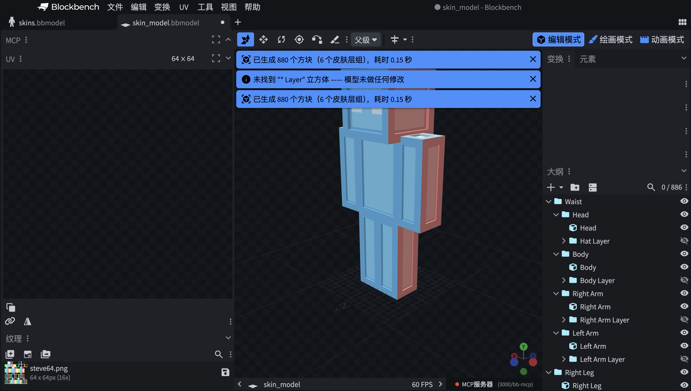

# Minecraft 3D Skin Layers

[](LICENSE)
[](../../releases)
[](https://blockbench.net)

English | [简体中文](README.zh-CN.md)

Turn any Minecraft skin into a **3D voxel model**: every texel becomes one
cube whose six faces map to that exact pixel. Start from a built-in template
and paint directly onto the voxels, or convert an existing skin model - all
in reversible, atomic undo steps.



## Installation

1. Download `minecraft_3d_skin_layers.js` from the
   [latest release](../../releases) (or build it: `npm run build`).
2. In Blockbench: **File > Plugins > ... > Load Plugin from File**, or copy
   the file into Blockbench's `plugins` folder.
3. Requires Blockbench **5.0.0+** (desktop).

## Where everything lives

| Entry point | What it does |
|---|---|
| Start screen / **File > New > 3D Skin Model** | New-skin wizard: template + texture size, creates a fully voxelized model |
| **Edit > Generate 3D Skin Layers** | Voxelize the `... Layer` cubes of the open model |
| **Edit > Restore 3D Skin Layers** | Convert generated groups back into their original single cubes |
| **3D Skin Model > Regenerate Cubes** | Rebuild generated voxels from the current texture, in place |
| **3D Skin Model > Clear Transparent Cubes** | Delete voxels whose pixel is transparent |

## Quick start A - paint a new skin (recommended)

1. **Start screen / File > New > 3D Skin Model**.
2. In the wizard pick a **template** (Classic / Root-wrapped / Jointed
   segments) and a **texture size** (64 or 128). The matching texture loads
   into the template and *every* pixel - transparent ones included - becomes
   a cube, so you can paint anywhere right away.
3. Paint your skin (Paint mode works; the texture behaves like a normal
   skin).
4. Clean up as you go:
   - **3D Skin Model > Clear Transparent Cubes** deletes voxels on pixels
     that are still transparent.
   - After bigger repaints, **3D Skin Model > Regenerate Cubes** rebuilds
     all voxels from the current texture - group poses are kept.

Every step is one undo transaction (`Ctrl/Cmd + Z`).

## Quick start B - voxelize an existing skin model

1. Open the model in **Edit** mode. It needs cubes named `... Layer`
   (`Hat Layer`, `Body Layer1`, ... - digit suffixes on jointed models are
   fine). The layer cubes' geometry and UVs are the source of truth, so
   64x64, 128x128 and custom layouts all work without a hard-coded atlas.
2. **Edit > Generate 3D Skin Layers**. The preflight dialog shows how many
   layer cubes and texels were found. Adjust the options and confirm.
3. To get the original model back: **Edit > Restore 3D Skin Layers** -
   generated groups store the complete original cube data (works after
   saving and reopening).

Both dialogs offer a **Use a new model project** checkbox at the bottom:
check it to duplicate the project and run against the copy - the original
tab stays untouched, and the copy never inherits the original's save path
(saving it always asks where to store it).

## Commands in detail

### Generate 3D Skin Layers
- One full cube per non-transparent texel, all six faces mapped to that
  pixel; thickness matches the layer inflate, so the shell reproduces the
  original layer contour.
- Replaces each `... Layer` cube with a same-named group in one atomic undo
  step; the preflight aborts above the cube limit before touching anything.
- Idempotent: generated groups are never re-processed.

### New 3D Skin Model wizard
- Templates are embedded in the plugin - no extra files needed. 128 loads a
  128x128 texture over the same 64-unit UV space (2x texel density, e.g.
  16x16 head faces).
- The model is voxelized immediately with **transparent pixels included**,
  ready for the paint-then-clean-up loop.

### Clear Transparent Cubes
- Removes generated voxels whose sampled pixel has become transparent.
  Safe by construction: only cubes inside plugin-generated groups are
  considered, and only when their UV maps exactly one texel.

### Regenerate Cubes
- Re-scans the current texture and rebuilds every generated group in place.
  Groups (and anything you posed on them) are kept; only the voxel cubes are
  replaced. Use it after repainting instead of undoing.

### Restore 3D Skin Layers
- Groups generated by this plugin store the full source cube; restore
  rebuilds it exactly and removes the voxels. Pre-0.3.1 groups fall back to
  a best-effort reconstruction.

## Options reference

Options are remembered across sessions.

| Option | Where | Default | Meaning |
|---|---|---|---|
| Use a new model project | Generate / Restore dialog | off | copy to a new project and modify the copy |
| Alpha threshold | Generate dialog | 0 | texels with alpha above this become cubes |
| Maximum cube count | Generate dialog | 10,000 | run aborts above this; nothing is modified |
| Cubes per batch | Generate dialog | 200 | UI yield frequency for large models |
| Keep original layer cubes | Generate dialog | off | hide the sources instead of deleting them |
| Replace fully transparent layers | Generate dialog | off | empty groups instead of leaving them untouched |
| Only process selected layers | Generate dialog | off | restrict to selected layer cubes |
| Generate on project load | Generate dialog | off | auto-run when a project opens |
| Include transparent pixels | Regenerate dialog | off | voxelize every grid cell, transparent ones too |

## Good to know

- **Z-fighting-free within a part**: face shells carry an invisible offset
  (max 0.0075). Parts that interpenetrate in the default pose (legs, waist)
  share planes on purpose - pose them and it separates.
- **Resolution-independent**: texel grids derive from texture size vs. UV
  space, never hard-coded.
- **Multi-texture, reversed UVs and face rotation** (0/90/180/270) are
  honored per face.
- **English & 简体中文** UI via Blockbench's translation system.

## Limitations

- Hairline seams can appear at extreme grazing angles along layer edges.
- Desktop only; the web variant is untested.
- Regeneration requires plugin-generated groups (metadata); legacy groups
  from before 0.3.1 support restore only.
- No greedy merging by design: one pixel = one cube is the contract.

## Development

```bash
npm install
npm run check      # typecheck + tests + build
npm run test:watch # vitest watch mode
```

- `docs/SPEC.md` - behavioral contract and defaults
- `docs/ARCHITECTURE.md` - module map, data flow, WriterHost seam
- `docs/UV_MAPPING.md` - the exact UV/geometry math (ported from Blockbench)
- `docs/TEST_PLAN.md` - test matrix and manual acceptance steps

Golden fixtures (characterized, covered by integration tests):
`skin_model.bbmodel` - 880 visible cubes; `skins_model_root.bbmodel` -
618 visible / 1632 full; `skins_model_root_joint.bbmodel` - 680 visible /
1792 full.

### Contributing

Issues and PRs welcome. Run `npm run check` before submitting and follow
[Conventional Commits](https://www.conventionalcommits.org).

## License

Released under the [MIT License](LICENSE).
