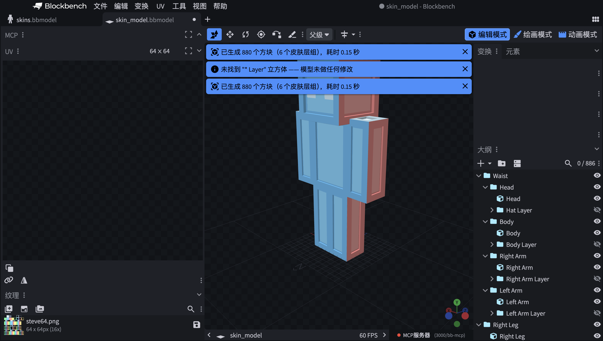

# Minecraft 3D 皮肤层

[](LICENSE)
[](../../releases)
[](https://blockbench.net)

[English](README.md) | 简体中文

一款 Blockbench 插件：将 Minecraft 皮肤外层转换为**逐像素体素方块**——`* Layer` 立方体上的每个可见像素都会生成一个完整的方块，六个面全部映射到该像素。原层立方体被替换为一个同名分组，整个过程可作为一次撤销完整回退。

适用于任何使用标准命名（`Hat Layer`、`Body Layer`、`Right/Left Arm Layer`、`Right/Left Leg Layer`）的 Minecraft 格式或通用模型，也支持关节模板中带数字后缀的分段层（如 `Body Layer1`、`Right Arm Layer2`）——现有层立方体的几何与 UV 就是唯一依据，因此 64×64、128×128 以及自定义 UV 布局都能直接工作，无需任何硬编码的皮肤图集。



## 特性

- **一个像素一个方块**——不隐藏、不跳过，每个体素六面全部启用并映射到同一源像素。
- **同部位零 Z 轴闪烁**——每个面方向的外壳带有微小偏移（最大 0.0075，视觉不可见），不同方向的面永不共面。已通过参考模型的精确矩形重叠分析验证。
- **忠实还原原层**——厚度与层膨胀值一致，体素外壳精确复现原第二层轮廓。
- **跨部位穿模保持原样**——默认姿势下互相穿透的部位（双腿、腰部）保留其共享平面；摆姿势后自然分离。
- **分辨率自适应**——UV 到纹理像素的换算由实际纹理尺寸与项目 UV 尺寸推导，128×128 皮肤自动得到 2 倍网格，无需任何特判。
- **安全且幂等**——每次运行为一次原子撤销事务，失败自动回滚；二次运行不做任何修改；超过方块数量上限时在修改模型之前即中止。
- **可保存后还原**——生成的分组会保存原始立方体数据，运行 **编辑 > 还原 3D 皮肤层** 即可还原为单个立方体；旧版本生成的分组也提供兼容回退。
- **中英文界面**，基于 Blockbench 原生翻译系统。

## 安装

1. 从[最新发布页](../../releases)下载 `minecraft_3d_skin_layers.js`，或自行构建（`npm run build`）。
2. 在 Blockbench 中：**文件 > 插件 > ...（齿轮图标）> 从文件加载插件**，或将文件复制到 Blockbench 的 `plugins` 文件夹。
3. 需要 Blockbench **5.0.0+**（桌面版）。

## 新功能：从模板新建 3D 皮肤模型

在开始界面（或 **文件 > 新建**）选择 **3D 皮肤模型** 格式：选择模板（经典 / 根分组 / 关节分段）与皮肤纹理尺寸（64 或 128）。对应纹理会加载进模板，**所有像素都会生成方块——包括透明像素**。绘制皮肤后，使用顶部菜单栏 **3D 皮肤模型 > 清除透明方块**，一步撤销事务即可移除透明像素处的方块。

## 使用

1. 在**编辑模式**下打开你的皮肤模型。
2. 运行 **编辑 > Generate 3D Skin Layers（生成 3D 皮肤层）**。
3. 预检对话框会显示找到的层数与可见像素数。调整选项并选择**目标模型**——直接修改当前模型，或复制为新模型并在副本上修改（原标签页保持不变）——然后确认。
4. 如需反向转换，运行 **编辑 > Restore 3D Skin Layers（还原 3D 皮肤层）**，即可移除体素分组并恢复原始层立方体。还原对话框提供同样的目标模型选择；选择副本时，体素化的原模型会完整保留。

### 选项

| 选项 | 默认值 | 说明 |
|---|---|---|
| 目标模型 | 修改当前模型 | 或复制为新模型并修改副本；副本不继承原项目的保存路径，不会覆盖原文件 |
| Alpha 阈值 | 0 | Alpha 高于该值的像素生成方块（0 = 每个非透明像素） |
| 最大方块数量 | 10,000 | 超过此数量将在修改前中止 |
| 每批方块数 | 200 | 每批创建的方块数量 |
| 保留原始层立方体 | 关 | 隐藏而不是删除源立方体 |
| 替换全透明层 | 关 | 用空分组替换完全透明的层 |
| 仅处理选中层 | 关 | 只处理被选中的层立方体 |
| 项目打开时自动生成 | 关 | 打开项目时自动运行生成 |

### 行为说明

- **每个非透明像素都生成一个完整体素**，六面全部启用——不隐藏、不跳过。
- **逐面 UV**：一个体素的六个面映射到同一个源像素。
- **同部位无 Z 轴闪烁**：每个面方向的网格带 0~0.0075 的微小偏移，不同方向的面永不共面；0.001 的抬升让体素内侧面离开基础方块表面。
- 默认姿势下互相穿透的不同部位（如双腿）保留其共享平面——这是有意为之，摆姿势后即可分离。
- **幂等**：只扫描名为 `... Layer` 的**立方体**，生成的分组不会被重复处理，二次运行为空操作。
- **原子性**：整个运行过程是一次撤销事务，失败自动回滚。
- 支持多纹理模型（每面使用自己的纹理）；反向 UV 与面旋转（0/90/180/270）均被正确处理。

### 已知限制

- 边缘/拐角处相邻面体素相接，极端掠射角下可能看到一条细缝。
- 默认姿势下互相穿透的部位在其共享平面上会相互闪烁（已接受；摆姿势后消失）。
- 暂时仅支持桌面版；网页版未测试。
- 对于 0.3.1 之前生成且原始立方体已被删除的分组，还原时采用尽力兼容重建；0.3.1 新生成的分组会保存完整源数据，可精确还原。
- 设计上不做相邻像素合并：一个像素一个方块是核心契约。

## 开发

```bash
npm install
npm run check      # 类型检查 + 测试 + 构建
npm run test:watch # vitest 监听模式
```

- `docs/SPEC.md` - 行为契约与默认值
- `docs/ARCHITECTURE.md` - 模块结构、数据流与 WriterHost 接缝
- `docs/UV_MAPPING.md` - UV/几何映射的精确数学（移植自 Blockbench）
- `docs/TEST_PLAN.md` - 测试矩阵与手工验收步骤

`tests/fixtures/skin_model.bbmodel` 为参考模型：一个 64×64 皮肤，其六个层立方体精确体素化为 **880 个方块**（黄金测试），并已在 Blockbench 5.1.6 真机验证。另有两个夹具覆盖新的关节模板：`skins_model_root.bbmodel`（整体包裹根分组、12 张纹理项目、2 倍像素密度——2828 个方块）与 `skins_model_root_joint.bbmodel`（躯干/四肢上下分段、数字后缀层命名、逐面 UV 层——404 个方块）。

### 参与贡献

欢迎提交 Issue 与 Pull Request。提交 PR 前请先运行 `npm run check`，并遵循
[Conventional Commits](https://www.conventionalcommits.org) 提交规范。

## 许可证

基于 [MIT 许可证](LICENSE)开源。
